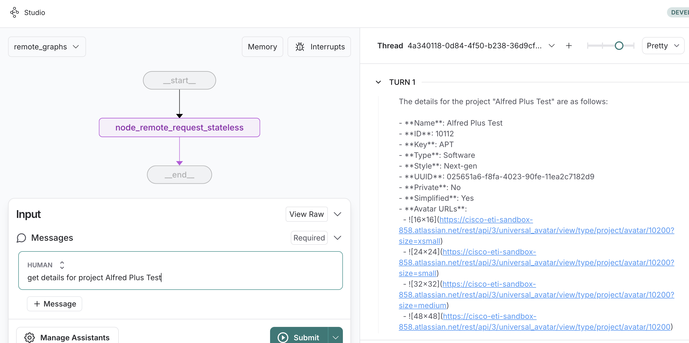
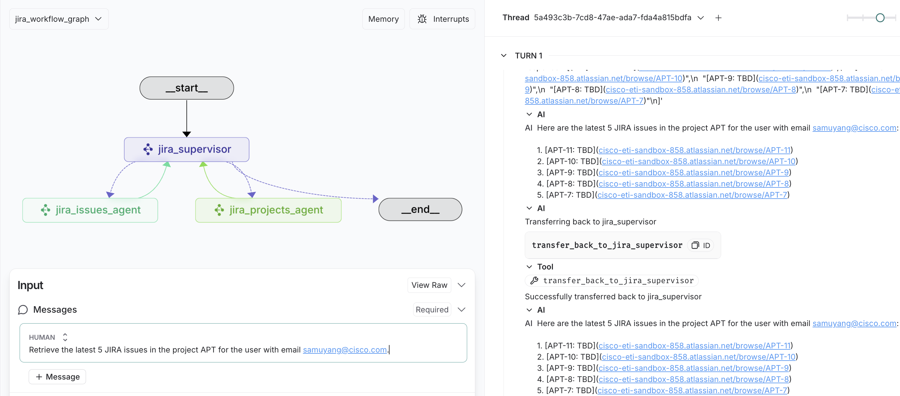

# Agntcy Jira AI Agent

## **Overview**
The **Jira AI Agent** conforms to AGNTCY specs as described https://github.com/agntcy.

This langchain agent performs specific Jira operations based on the user prompt supplied. It can easily be inserted into agentic applications via its supported APIs.


## **📌 About the Project**

This repository contains a **Jira AI Agent**. It comprises a supervisor AI Agent and various sub-agents to perform various Jira related operations.

Existing functionality supported includes:
1. Jira issue operations - querying, creation, updation, assignment, transitions.
2. Jira project operations - querying, creation, updation, assignment.

This agent was built with **FastAPI**, that can operate using:

- A **standard API** compatible with [LangChain’s Agent Protocol](https://github.com/langchain-ai/agent-protocol) — an open-source framework for interfacing with AI agents.

---
## **📋 Prerequisites**
Before installation, ensure you have:
- **Python 3.12+** installed
- A **virtual environment** (recommended for dependency isolation)

---
## **⚙️ Installation Steps**

### **1️⃣ Clone the Repository**

```bash
git clone https://github.com/cisco-outshift-alfred/jira-agntcy-agent.git
cd jira-agntcy-agent
```
---
### **2️⃣ Setup the environment variables**

### Required Environment Variables
Before running the application, ensure you have the following environment variables set in your .env file or in your environment:

#### **🔹 Jira Configuration**

```bash
JIRA_INSTANCE=your-jira-domain # For example: https://your-jira-domain.atlassian.net 
JIRA_USERNAME=your-jira-username # Valid Jira username or email
JIRA_API_TOKEN=your-jira-api-token # Jira API Token with proper permissions
```
The **Jira Instance** must be https only and should not have a trailing slash (i.e., `https://your-jira-domain.atlassian.net`). 
The **Jira User and API Token** must be configured with the **appropriate permissions** for the **Jira instance**.
The permissions supported on Jira instance can be obtained using the [Permissions Jira API](https://developer.atlassian.com/cloud/jira/platform/rest/v3/api-group-permissions/#api-rest-api-3-permissions-get)
The permissions for a particular Jira user can be obtained using the [My Permissions Jira API](https://developer.atlassian.com/cloud/jira/platform/rest/v3/api-group-permissions/#api-rest-api-3-mypermissions-get)

#### **🔹 OpenAI or Azure OpenAI API Configuration**

You can configure your AI agent to use either OpenAI or Azure OpenAI as its LLM provider. 
Set the appropriate variables based on your choice (if unspecified , defaults to 'azure'): 
```bash
LLM_PROVIDER=azure # or openai
```

For OpenAI:
```bash
OPENAI_API_KEY=your-openai-api-key-here
OPENAI_API_VERSION=gpt-4o  # Specify the model name
OPENAI_TEMPERATURE=0.7    # Adjust temperature for response randomness
```

For Azure OpenAI:
```bash
AZURE_OPENAI_API_KEY=your-azure-api-key-here
AZURE_OPENAI_ENDPOINT=https://your-resource-name.openai.azure.com
AZURE_OPENAI_DEPLOYMENT=your-deployment-name  # Deployment name in Azure
AZURE_OPENAI_API_VERSION=your-azure-openai-api-version  # API version
OPENAI_TEMPERATURE=0.7 # Adjust temperature for response randomness
```

#### **🔹 LangChain Configuration(Optional)**
Export these environment variables to integrate Langchain tracing and observability functionalities for your agent.
```bash
LANGCHAIN_TRACING_V2=true  # Enable LangChain tracing
LANGCHAIN_ENDPOINT=your-langchain-endpoint  # The LangChain API endpoint
LANGCHAIN_API_KEY=your-langchain-api-key   # API key for LangChain
LANGCHAIN_PROJECT=your-langchain-project-name  # Project name in LangChain
LANGSMITH_API_KEY=your-langsmith-api-key   # API key for LangSmith
```

---
### **3️⃣ Setup the virtual environment**

```bash
python -m venv venv
source venv/bin/activate
pip install -r requirements.txt
```
A **Makefile** is provided to do the same:

```bash
make venv/bin/activate
```

---
✅ **Now you're ready to run the application!**
### Server

You can run the application by executing:

```bash
make run
```

or

```bash
python src/main.py
```
### Expected Console Output

On a successful run, you should see logs in your terminal similar to the snippet below. The exact timestamps, process IDs, and file paths will vary:

```bash
python app/main.py
{"timestamp": "2025-03-14 18:04:29,821", "level": "INFO", "message": "Logging is initialized. This should appear in the log file.", "module": "logging_config", "function": "configure_logging", "line": 158, "logger": "app", "pid": 53852}
{"timestamp": "2025-03-14 18:04:29,821", "level": "INFO", "message": "Starting FastAPI application...", "module": "main", "function": "main", "line": 197, "logger": "app", "pid": 53852}
{"timestamp": "2025-03-14 18:04:29,822", "level": "INFO", "message": ".env file loaded from /Users/sushroff/Documents/AI/jira-agent/.env", "module": "main", "function": "load_environment_variables", "line": 47, "logger": "root", "pid": 53852}
INFO:     Started server process [53852]
INFO:     Waiting for application startup.
{"timestamp": "2025-03-14 18:04:29,851", "level": "INFO", "message": "Starting Jira Agent...", "module": "main", "function": "lifespan", "line": 71, "logger": "root", "pid": 53852}
INFO:     Application startup complete.
INFO:     Uvicorn running on http://0.0.0.0:8125 (Press CTRL+C to quit)
```

This output confirms that:

1. Logging is properly initialized.
2. The server is listening on `0.0.0.0:8125`.
3. Your environment variables (like `.env file loaded`) are read.

### AP REST Client

*Change to `clients` folder*

*Update the user_prompt in `clients/ap_client/client.py` to the desired prompt (sample prompts available in `clients/sample_prompts/`*

The REST client connects to the AP endpoint for the Server running at the default port 8125

```bash
python clients/ap_client/client.py
```
On a successful remote graph run you should see logs in your terminal similar to the snippet below:

```bash
{"timestamp": "2025-03-14 17:58:29,328", "level": "INFO", "message": "{'event': 'final_result', 'result': {'messages': [HumanMessage(content='is Alfred Plus Test a business project', additional_kwargs={}, response_metadata={}, id='6ddcc789-0196-4e24-86fc-f2119be43cdf'), HumanMessage(content='The project \"Alfred Plus Test\" is a software project, not a business project.', additional_kwargs={}, response_metadata={}, id='140ef897-cdb6-459d-914c-b5d2d2fd8281')]}}", "module": "rest", "function": "main", "line": 203, "logger": "graph_client", "pid": 51728}
```

Sample API request and response for running a remote graph AP request can be sent via:

*http://0.0.0.0:8125/docs#/Stateless%20Runs/Stateless%20Runs-run_stateless_runs_post*

```bash
curl -X 'POST' \
  'http://0.0.0.0:8125/api/v1/runs' \
  -H 'accept: application/json' \
  -H 'Content-Type: application/json' \
  -d '{
    "agent_id": "remote_agent",
    "input": {
        "query": "create a jira issue in project Alfred Plus Test, to implement an Agent"
    },
    "metadata": {
        "id": "c303282d-f2e6-46ca-a04a-35d3d873712d"
    }
}'

200 OK
{
  "agent_id": "remote_agent",
  "output": "The Jira issue to implement an Agent has been successfully created in the \"Alfred Plus Test\" project. You can view and manage the issue at [this link](https://cisco-eti-sandbox-858.atlassian.net/browse/APT-13).",
  "model": "gpt-4o",
  "metadata": {}
}
```

---
## Docker

Alternatively, you can run the application with Docker by building the Docker image and running the container.

```bash
make docker-build
make docker-run
```

or

- **Build and Run the Docker Container**: Start a container from the built image, using the `.env` file for environment variables and mapping port 8125.

```bash
docker build -t your_docker_image_name .
docker run --env-file .env -p 8125:8125 your_docker_image_name
 ```

---
## Logging

- **Format**: The application is configured to use JSON logging by default. Each log line provides a timestamp, log level, module name, and the message.
- **Location**: Logs typically go to stdout when running locally. If you configure a file handler or direct logs to a centralized logging solution, they can be written to a file (e.g., `logs/app.log`) or shipped to another service.
- **Customization**: You can change the log level (`info`, `debug`, etc.) or format by modifying environment variables or the logger configuration in your code. If you run in Docker or Kubernetes, ensure the logs are captured properly and aggregated where needed.

## API Endpoints

By default, the API documentation is available at:

```bash
http://0.0.0.0:8125/docs
```

(Adjust the host and port if you override them via environment variable JIRA_AGENT_PORT.)

---
## Running as a LangGraph Studio

You need to install Rust: <https://www.rust-lang.org/tools/install>

Run the server

*To see the graph for the end client using LangGraph AP*
```bash
make graph-ap
```
Upon successful execution, you should see:




*To see the graph for the entire jira workflow server*
```bash
make langgraph-dev
```

Upon successful execution, you should see:


---
## Running Unit and Evaluation Tests

To run the tests or eval tests, you need to set up the environment variables and then execute the respective test command.

1. **Set the Environment Variables**:  
   Add the required variables to your `.env` file or export them directly in your shell.

   Example `.env` file or export these environment variables directly in your shell:
   ```bash
   LANGCHAIN_API_KEY=your-langsmith-api-key
   # OpenAI Configuration
   OPENAI_ENDPOINT=https://api.openai.com/v1
   OPENAI_API_KEY=your-openai-api-key
   # Alternatively, for Azure OpenAI
   AZURE_OPENAI_ENDPOINT=https://your-azure-endpoint.openai.azure.com
   AZURE_OPENAI_API_KEY=your-azure-api-key
   AZURE_OPENAI_API_VERSION=2023-03-15-preview
   AZURE_OPENAI_DEPLOYMENT=gpt-4o
   
   LLM_PROVIDER=azure # or openai
   ```

2. **Run the Tests**:
    - To run the standard tests, execute:
      ```bash
      make run-test
      ```
    - To run the eval tests, execute:
      ```bash
      make eval
      ```
    - To run the eval tests (with Langsmith tracing disabled), execute:
      ```bash
      make eval-langsmith-tracking-disabled
      ```
      *Note* - When running the Eval Tests. If not using Langsmith for tracing, the `LANGCHAIN_API_KEY' is not required.

This will ensure the environment variables are loaded and the tests are executed.

---
## Roadmap

See the [open issues](https://github.com/cisco-outshift-alfred/jira-agntcy-agent/issues) for a list
of proposed features (and known issues).

---
## Contributing

Contributions are what make the open source community such an amazing place to
learn, inspire, and create. Any contributions you make are **greatly
appreciated**. For detailed contributing guidelines, please see
[CONTRIBUTING.md](CONTRIBUTING.md)

Please ensure commits conform to the [Commit Guideline](https://www.conventionalcommits.org/en/v1.0.0/ )

---
## License

Distributed under the Apache-2.0 License. See [LICENSE](LICENSE) for more
information.

---
## Contact

[cisco-outshift-ai-agents@cisco.com](mailto:cisco-outshift-ai-agents@cisco.com)

Project Link: 
[https://github.com/cisco-outshift-alfred/jira-agntcy-agent/](https://github.com/cisco-outshift-alfred/jira-agntcy-agent/)

---
## Acknowledgements

This template was adapted from
[https://github.com/othneildrew/Best-README-Template](https://github.com/othneildrew/Best-README-Template).

For more information about our various agents, please visit the [agntcy project page](https://github.com/agntcy).
